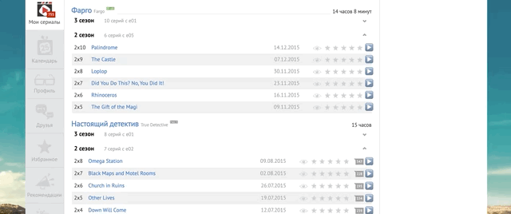

Расширение работает на странице: https://myshows.me/profile/


# Установка

Установить расширение https://www.tampermonkey.net/
В расширении создать новый скрипт и вставить содержимое userscript.js
Указать в SERVER_API_PATH адрес сервера в формате https://domain.name/api

Установите https://www.sodaplayer.com/

# Настройка сервера:

```
RUTRACKER_USERNAME=
RUTRACKER_PASSWORD=
```

Установить зависимостей npm install && npm run build
Запуск npm start
